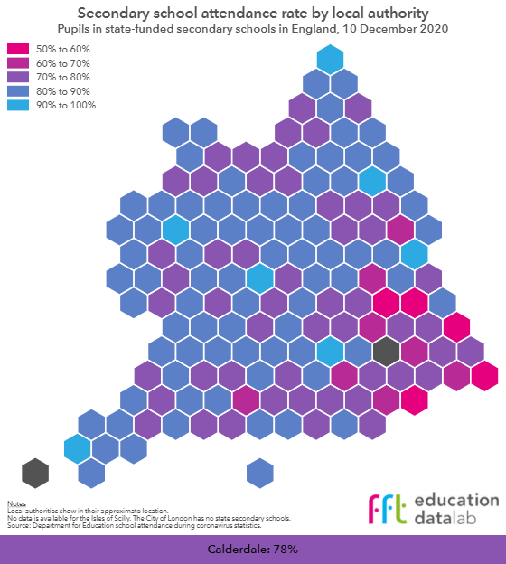

# absence-hexmap
An interactive hexmap of secondary school absence data for England during the second wave of Covid-19, made using D3. View [the live version of the visualisation here](https://ffteducationdatalab.org.uk/2020/10/pupils-in-the-poorest-areas-of-the-country-are-missing-the-most-schooling/).

The visualisation takes as input a JSON file of pupil absence rates for state-funded secondary schools in England on 15 October (`secondary_absence.json`). The source of this data is ultimately [a response to a parliamentary question](https://questions-statements.parliament.uk/written-questions/detail/2020-10-16/104751). The data file is combined with a [hexJSON](https://odileeds.org/projects/hexmaps/hexjson.html) file describing the position of upper-tier local authorities in England (`uk-upper-tier-local-authorities.hexjson`).

The visualisation makes use of [Oli Hawkins' d3-hexjson package](https://github.com/olihawkins/d3-hexjson). The hexJSON file is one of our own making - taking a file shared by [ODI Leeds](https://github.com/odileeds/hexmaps) as a starting point, but making substantial revisions.

(NB: The odd directory structure in this repository is simply to allow the files to be added to our content management system easily.)
